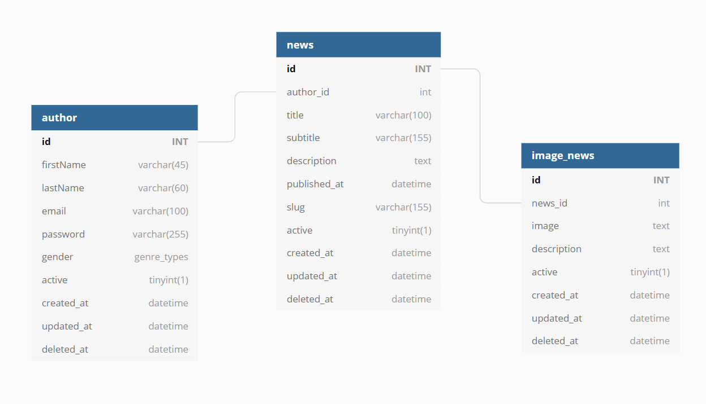

# <p align="center">CTV News API :newspaper:</p>

<p align="center">


</p>

## 💬 About

This project was developed following Console TV youtube playlist "[Lumen Microframework](https://www.youtube.com/playlist?list=PLTZ2g-iFpCUuNWZ7wtDoxbKpSAChDyS0o)".

## :computer: Technologies

-   [Lumen](https://lumen.laravel.com/)
-   [Docker](https://www.docker.com/)

## 🧰 Architecture

### DB ER Diagram



### Service-Repository Pattern

## :octocat: Setup

### Installation

```sh
# Clone this repo
git@github.com:filipe1309/ctv-news-api.git

# Enter project folder
cd ctv-news-api
```

#### Run the migrations to create db tables

```sh
php artisan migrate
```

### 🏃 Runnning

```sh
./bin/runenv
```

The app will run at: http://localhost:5001

## About Me

<p align="center">
    <a style="font-weight: bold" href="https://www.linkedin.com/in/filipe1309/">
    
    </a>
</p>

---

<p align="center">
Done with ♥ by <a style="font-weight: bold" href="https://www.linkedin.com/in/filipe1309/">Filipe Leuch Bonfim</a> 🖖

</p>
